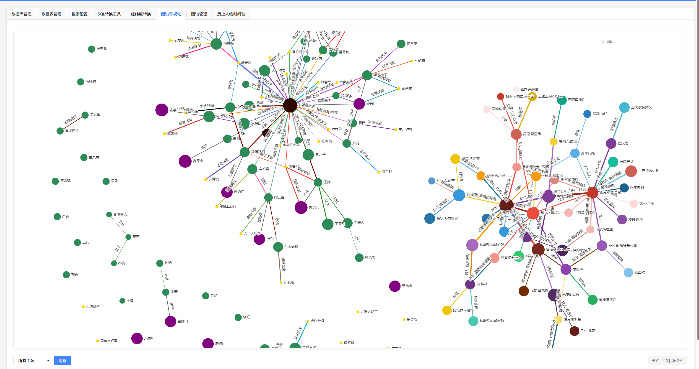
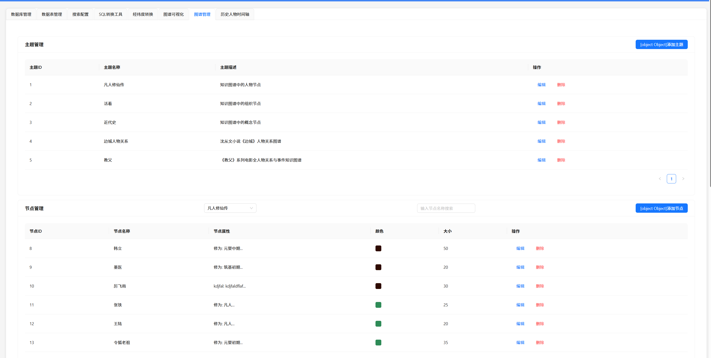
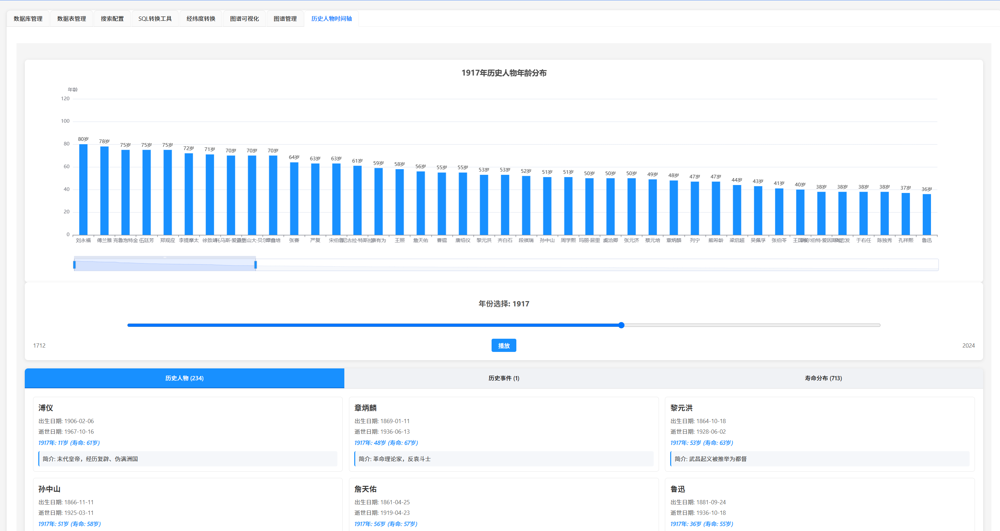
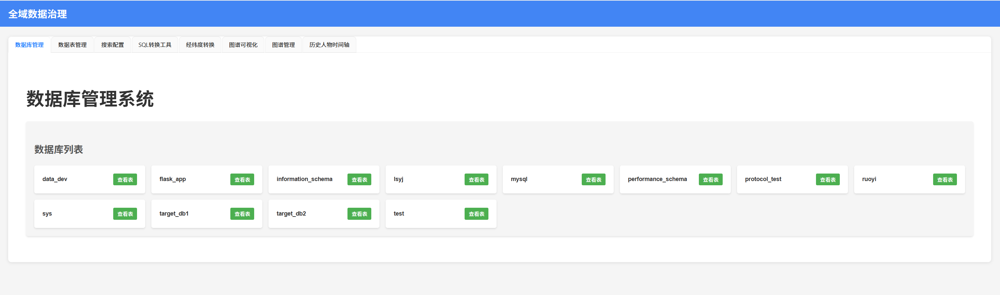
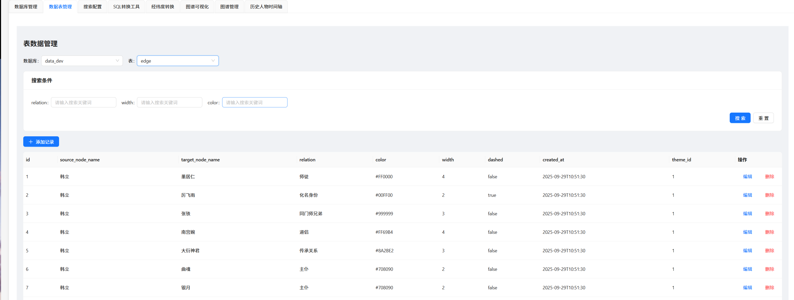
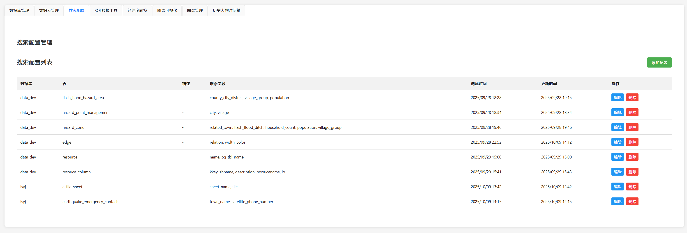
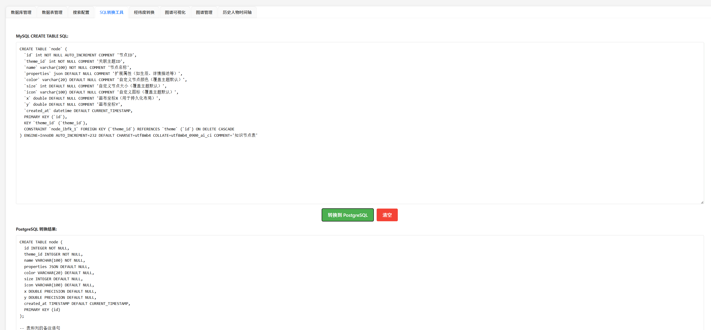
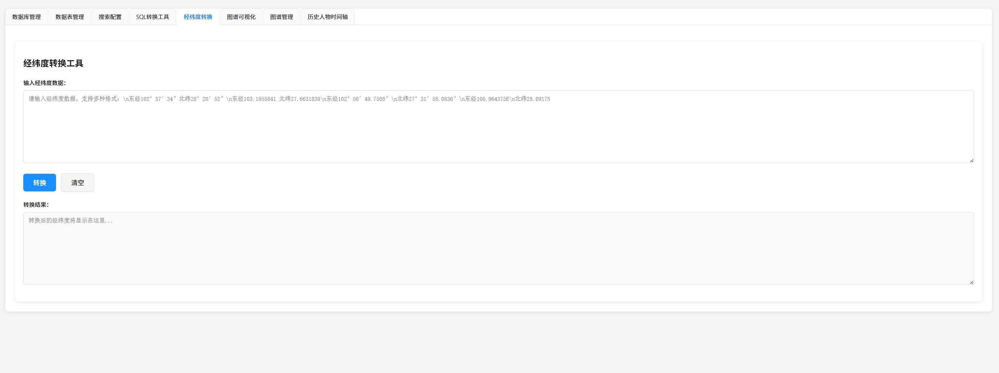

# 知识图谱可视化系统

## 项目介绍
这是一个基于Spring Boot和Vue3开发的知识图谱可视化系统，使用MySQL作为数据存储，支持节点和关系的管理与可视化展示。

## 技术栈
- **后端**：Spring Boot、Spring Data JPA、MySQL
- **前端**：Vue3、Vite、ECharts、D3.js、Axios

## 目录结构
```
├── frontend/          # 前端Vue3项目
├── src/               # 后端Java源码
│   ├── main/java/com/example/graph/  # 后端主要代码
│   └── main/resources/               # 配置文件
├── pom.xml            # Maven项目依赖配置
└── README.md          # 项目说明文档
```

## 数据库设计
系统使用三个主要表来存储知识图谱数据：

### 主题分类表 (theme)
```sql
CREATE TABLE `theme` (
  `id` INT AUTO_INCREMENT PRIMARY KEY COMMENT '主题ID',
  `name` VARCHAR(50) NOT NULL COMMENT '主题名称（如"人物"、"事件"）',
  `description` TEXT COMMENT '主题描述',
  `default_node_color` VARCHAR(20) DEFAULT '#4285F4' COMMENT '默认节点颜色（十六进制）',
  `default_node_size` INT DEFAULT 20 COMMENT '默认节点大小（像素）',
  `default_node_icon` VARCHAR(100) DEFAULT '⭐' COMMENT '默认节点图标（emoji或图标库类名）',
  `default_edge_color` VARCHAR(20) DEFAULT '#999999' COMMENT '默认边颜色',
  `default_edge_width` INT DEFAULT 2 COMMENT '默认边宽度（像素）',
  `created_at` DATETIME DEFAULT CURRENT_TIMESTAMP COMMENT '创建时间'
) ENGINE=InnoDB DEFAULT CHARSET=utf8mb4 COMMENT='主题分类表';
```

### 知识节点表 (node)
```sql
CREATE TABLE `node` (
  `id` INT AUTO_INCREMENT PRIMARY KEY COMMENT '节点ID',
  `theme_id` INT NOT NULL COMMENT '关联主题ID',
  `name` VARCHAR(100) NOT NULL COMMENT '节点名称',
  `properties` JSON DEFAULT NULL COMMENT '扩展属性（如生辰、详情描述等）',
  `color` VARCHAR(20) COMMENT '自定义节点颜色（覆盖主题默认）',
  `size` INT COMMENT '自定义节点大小（覆盖主题默认）',
  `icon` VARCHAR(100) COMMENT '自定义图标（覆盖主题默认）',
  `x` DOUBLE COMMENT '画布坐标X（用于持久化布局）',
  `y` DOUBLE COMMENT '画布坐标Y',
  `created_at` DATETIME DEFAULT CURRENT_TIMESTAMP,
  FOREIGN KEY (`theme_id`) REFERENCES `theme` (`id`) ON DELETE CASCADE
) ENGINE=InnoDB DEFAULT CHARSET=utf8mb4 COMMENT='知识节点表';
```

### 节点关系表 (edge)
```sql
CREATE TABLE `edge` (
  `id` INT AUTO_INCREMENT PRIMARY KEY COMMENT '边ID',
  `source_node_name` varchar(100) NOT NULL COMMENT '源节点ID',
  `target_node_name` varchar(100) NOT NULL COMMENT '目标节点ID',
  `relation` VARCHAR(50) NOT NULL COMMENT '关系描述（如"创始人"、"参与"）',
  `color` VARCHAR(20) COMMENT '自定义边颜色',
  `width` INT DEFAULT 2 COMMENT '边宽度',
  `dashed` BOOLEAN DEFAULT FALSE COMMENT '是否虚线',
  `created_at` DATETIME DEFAULT CURRENT_TIMESTAMP,
  `theme_id` INT NOT NULL COMMENT '关联主题ID',
) ENGINE=InnoDB DEFAULT CHARSET=utf8mb4 COMMENT='节点关系表';
```

## 数据库配置
数据库连接信息已配置在`application.properties`文件中：
```properties
spring.datasource.url=jdbc:mysql://localhost:3306/data_dev?rewriteBatchedStatements=true&useSSL=false&serverTimezone=UTC
spring.datasource.username=root
spring.datasource.password=9ijn)OKM
spring.datasource.driver-class-name=com.mysql.cj.jdbc.Driver
```

## 快速开始

### 前提条件
- JDK 11 或更高版本
- Maven 3.6+ 或使用IDE内置的Maven
- Node.js 14+ 和 npm 6+
- MySQL 5.7+ 或 8.0+

### 运行后端
1. 确保MySQL数据库已启动，并且已创建名为`data_dev`的数据库
2. 使用Maven构建并运行Spring Boot应用：
```bash
mvn clean install
mvn spring-boot:run
```

应用启动后，后端服务将运行在`http://localhost:8080`，并且会自动初始化一些示例数据。

### 运行前端
1. 进入frontend目录：
```bash
cd frontend
```
2. 安装依赖：
```bash
npm install
```
3. 启动开发服务器：
```bash
npm run dev
```

前端应用将运行在`http://localhost:5173`（端口可能会根据可用情况有所不同）。

## 功能特性
1. **知识图谱可视化**：支持两种可视化方式（ECharts和D3.js）
2. **主题分类管理**：可创建不同主题，每个主题可自定义节点样式
3. **节点管理**：支持创建、编辑、删除节点，可设置节点的属性、颜色、大小等
4. **关系管理**：支持创建、编辑、删除节点间的关系
5. **交互式操作**：支持拖拽节点、缩放图表、点击查看详情等

## 系统截图

### 图谱可视化


### 图谱管理


### 历史人物时间轴


### 数据库管理


### 数据表管理


### 搜索配置


### SQL转换


### 经纬度转换


## API接口说明
系统提供了完整的RESTful API接口，主要包括：

### 主题相关接口
- GET /api/themes - 获取所有主题
- GET /api/themes/{id} - 获取指定主题
- POST /api/themes - 创建新主题
- PUT /api/themes/{id} - 更新主题
- DELETE /api/themes/{id} - 删除主题

### 节点相关接口
- GET /api/nodes - 获取所有节点
- GET /api/nodes/{id} - 获取指定节点
- GET /api/nodes/theme/{themeId} - 获取指定主题下的所有节点
- POST /api/nodes - 创建新节点
- PUT /api/nodes/{id} - 更新节点
- DELETE /api/nodes/{id} - 删除节点

### 边相关接口
- GET /api/edges - 获取所有边
- GET /api/edges/{id} - 获取指定边
- GET /api/edges/node/{nodeId} - 获取与指定节点相关的所有边
- POST /api/edges - 创建新边
- PUT /api/edges/{id} - 更新边
- DELETE /api/edges/{id} - 删除边

### 知识图谱相关接口
- GET /api/graph/full - 获取完整的知识图谱数据
- GET /api/graph/theme/{themeId} - 获取指定主题的知识图谱数据

## 示例数据
系统启动时会自动初始化一些示例数据，包括：
- 3个主题（人物、组织、概念）
- 7个节点（3个人物、2个组织、2个概念）
- 9条关系（表示人物与组织、人物与概念、组织与概念之间的关联）

## 部署说明

### 后端部署
可以将Spring Boot应用打包为JAR文件：
```bash
mvn clean package
```
然后使用Java命令运行：
```bash
java -jar target/knowledge-graph-1.0.0.jar
```

### 前端部署
构建前端应用：
```bash
cd frontend
npm run build
```
构建后的文件位于`frontend/dist`目录，可以部署到任何静态文件服务器。

## 注意事项
1. 确保数据库连接配置正确
2. 首次启动应用时会自动创建数据库表并初始化示例数据
3. 如需修改API基础URL，请在前端项目的`.env`文件中修改`VITE_API_BASE_URL`配置
4. 如果遇到跨域问题，请检查后端的CORS配置

## 后续改进方向
1. 添加更多的可视化样式和布局算法
2. 增加节点和关系的高级查询功能
3. 实现批量导入/导出功能
4. 添加用户认证和权限管理
5. 优化大数据量下的性能表现

## 联系方式
如有问题或建议，请联系项目维护者。